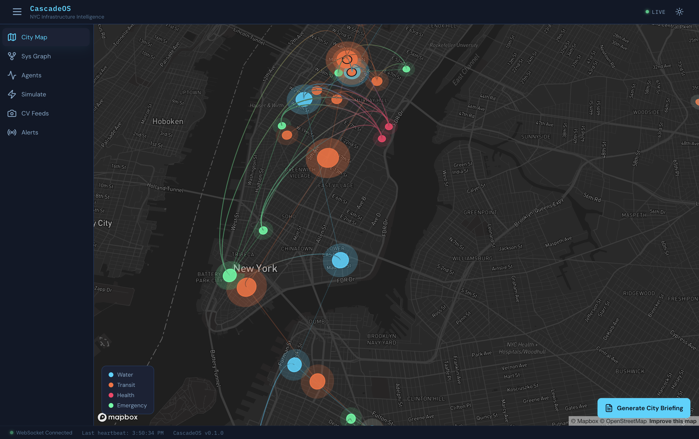
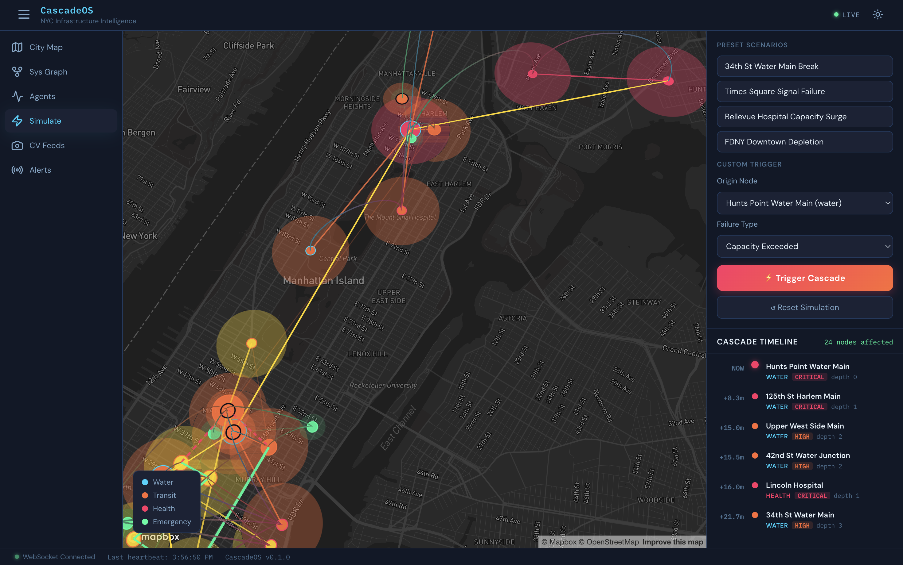
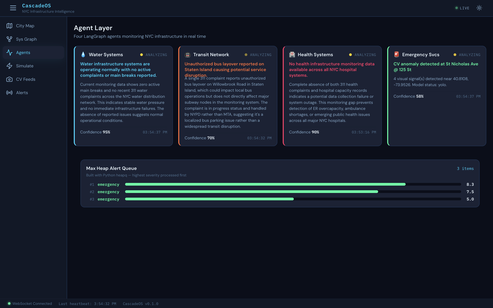
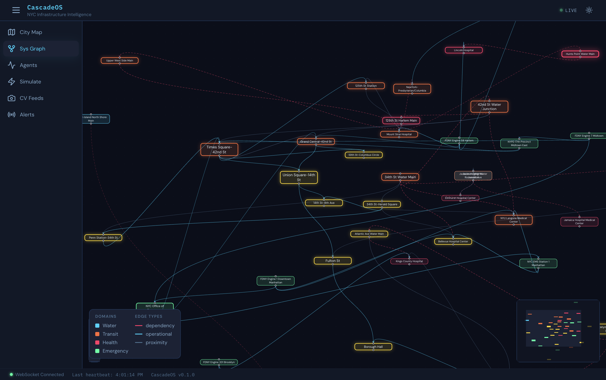
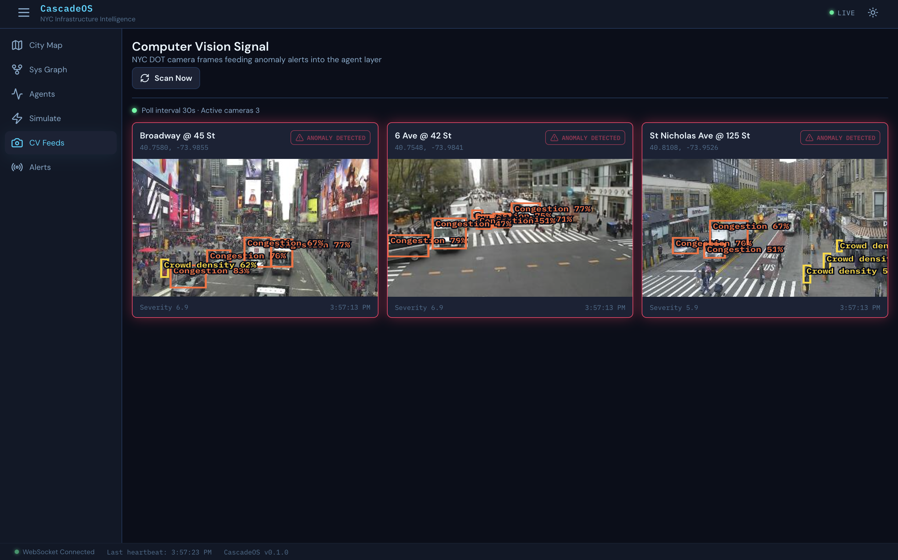
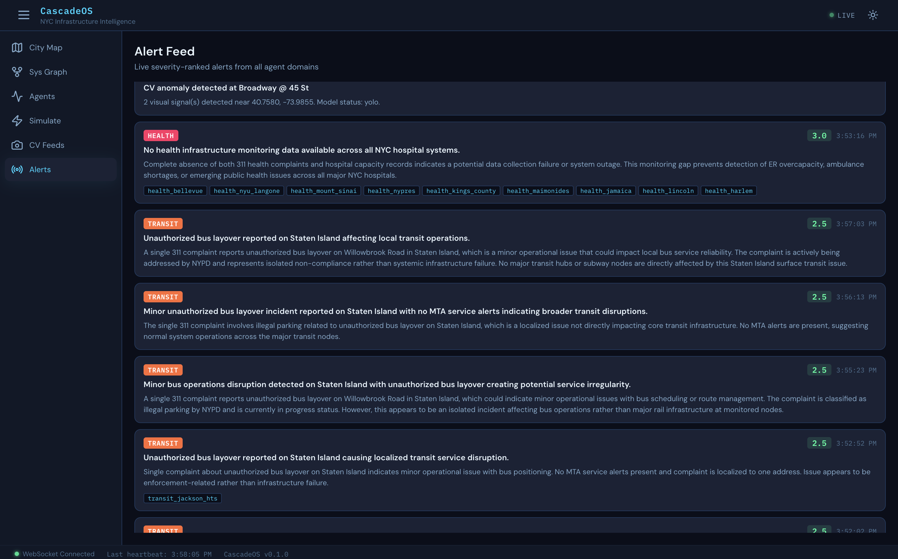
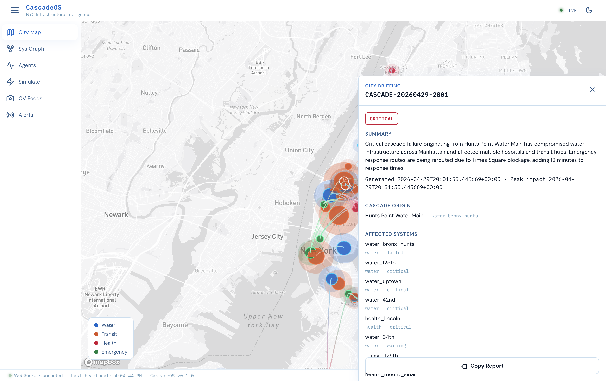
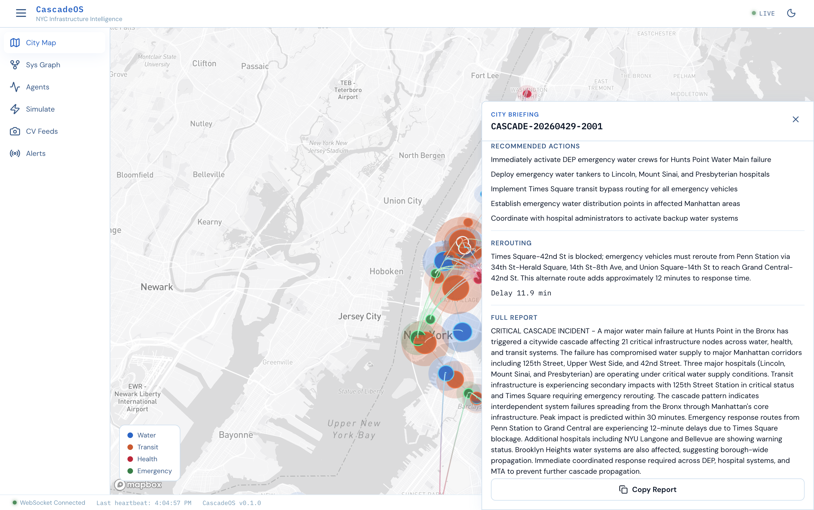

# CascadeOS

## HACKATHON WINNING IDEA

CascadeOS won **first prize at the Code 4 City Hackathon** at NYU Tandon. I built it as a solo project under team **Core Catalyst**, competing against 44 teams.

CascadeOS is a multi agent urban infrastructure intelligence system for New York City. It predicts how failures can cascade across water, transit, health, and emergency systems, then helps city officials understand the impact through live maps, agent alerts, rerouting, camera signals, and generated briefings.

I am **Raunak Choudhary**, an MS Computer Science graduate student at **New York University**, class of 2026. I built CascadeOS as solo team **Core Catalyst**.

## Recruiter Snapshot

* **Solo first place hackathon build:** designed, engineered, tested, and presented by one developer.
* **Full stack AI system:** FastAPI backend, React frontend, real time WebSockets, graph algorithms, agents, computer vision, and city operations UX.
* **Tech highlights:** FastAPI, React, WebSockets, NetworkX, LangGraph, Claude, YOLOv8, deck.gl, Dijkstra, BFS, priority queue.
* **Core engineering signal:** combines product thinking, backend architecture, frontend polish, graph reasoning, ML integration, and demo reliability.

## Product Screenshots

<p align="center">
  
  
</p>

<p align="center">
  
  
</p>

<p align="center">
  
  
</p>

<p align="center">
  
  
</p>

## What I Built

I built CascadeOS as a full stack demonstration of real time civic infrastructure reasoning.

The system combines:

* A 40 node NYC infrastructure graph built with NetworkX
* Four AI monitoring agents for water, transit, health, and emergency systems
* A weighted BFS cascade prediction engine
* Dijkstra emergency rerouting after a cascade
* Claude Sonnet powered city briefing generation
* NYC DOT traffic camera integration with YOLOv8 detections
* A React and deck.gl interface with dark and light themes
* WebSocket based real time updates across alerts, cascades, reroutes, and CV signals

## Why This Matters

Urban infrastructure failures rarely stay isolated. A water main break can affect subway access, hospital operations, emergency movement, and public safety. CascadeOS shows how a city operations team could reason across those systems in one place instead of reacting through disconnected dashboards.

The demo story is simple:

1. A water main failure is triggered near 34th Street.
2. The system predicts which infrastructure nodes are affected next.
3. The map and system graph animate the cascade.
4. The alert queue ranks the most urgent signals.
5. Dijkstra computes an alternate emergency route.
6. Claude generates a structured city briefing.
7. YOLOv8 camera detections feed visual anomalies into the same alert pipeline.

## Feature Status

| Phase | Status | What was delivered |
| --- | --- | --- |
| Phase 0 | Complete | FastAPI backend, React frontend, theme system, WebSocket heartbeat |
| Phase 1 | Complete | NYC infrastructure graph, deck.gl map, React Flow system graph |
| Phase 2 | Complete | Four agents, 311 surge detector, max heap alert queue |
| Phase 3 | Complete | Weighted BFS cascade prediction and simulation timeline |
| Phase 4 | Complete | Dijkstra rerouting and Claude city briefing |
| Phase 5 | Complete | NYC DOT camera feeds and YOLOv8 signal pipeline |
| Phase 6 | Complete | Documentation, shortcuts, polish, loading states, demo readiness |

## Repository Structure

```text
cascadeos/
  backend/              FastAPI app, agents, graph algorithms, CV pipeline
  frontend/             React and Vite app with map, graph, agents, and simulation UI
  docs/                 Demo, deployment, and planning documentation
  graphify-out/         Generated knowledge graph of the codebase
  CLAUDE.md             Full project blueprint and phase plan
```

## Requirements

Local development needs:

* Python 3.12
* Node 20 or newer
* npm
* Git
* A Mapbox token
* An Anthropic API key
* A NYC Open Data app token

Optional for the full CV demo:

* YOLOv8 weights at `backend/cv/models/yolov8n.pt`
* Python ML packages from `backend/requirements-ml.txt`

The NYC DOT camera API is public and does not need an API key.

## Environment Files

Real secrets must live only in `.env` files. They are intentionally ignored by Git.

Create backend env:

```bash
cp backend/.env.example backend/.env
```

Create frontend env:

```bash
cp frontend/.env.example frontend/.env
```

Backend variables:

```text
ANTHROPIC_API_KEY=
NYC_OPEN_DATA_APP_TOKEN=
NYC_311_ENDPOINT=https://data.cityofnewyork.us/resource/erm2-nwe9.json
NYC_DOT_CAMERA_API_URL=https://webcams.nyctmc.org/api/cameras
HOST=0.0.0.0
PORT=8000
CORS_ORIGINS=http://localhost:5173
APP_ENV=development
MODEL_CHECKPOINT_PATH=./ml/checkpoints/tgnn_latest.pt
YOLO_MODEL_PATH=./cv/models/yolov8n.pt
ENABLE_CV=true
ENABLE_TGNN=true
CASCADE_PLAYBACK_SPEED=1.0
CV_POLL_INTERVAL=30
```

Frontend variables:

```text
VITE_API_URL=http://localhost:8000
VITE_WS_URL=ws://localhost:8000/ws
VITE_MAPBOX_TOKEN=
```

## Backend Setup

From the repo root:

```bash
cd backend
python -m venv .venv
source .venv/bin/activate
pip install --upgrade pip
pip install -r requirements.txt
```

For true YOLOv8 inference:

```bash
pip install -r requirements-ml.txt
```

Start the backend:

```bash
python -m uvicorn main:app --reload --host 0.0.0.0 --port 8000
```

Backend health check:

```bash
python -c "from main import app; print('OK')"
```

API docs are available at:

```text
http://localhost:8000/docs
```

## Frontend Setup

From the repo root:

```bash
cd frontend
npm install
npm run dev -- --host 0.0.0.0
```

Open:

```text
http://localhost:5173
```

Frontend build check:

```bash
npm run build
```

## Running the Full App

Use two terminals.

Terminal 1:

```bash
cd backend
source .venv/bin/activate
python -m uvicorn main:app --reload --host 0.0.0.0 --port 8000
```

Terminal 2:

```bash
cd frontend
npm run dev -- --host 0.0.0.0
```

Then open:

```text
http://localhost:5173
```

## Demo Walkthrough

The intended judge walkthrough takes about three minutes.

1. Open CascadeOS in dark mode.
2. Start on City Map and show the real NYC infrastructure nodes.
3. Point to glowing nodes and explain centrality.
4. Switch to Agents and show the four monitoring agents.
5. Switch to Simulate.
6. Choose `34th St Water Main Break`.
7. Trigger the cascade.
8. Watch the map and timeline animate.
9. Return to City Map and show the red blocked corridor and green reroute.
10. Click `Generate City Briefing`.
11. Show the structured report and copy action.
12. Switch to CV Feeds and show NYC DOT camera detections.
13. Switch to Alerts and show CV or agent signals in the queue.

## Keyboard Shortcuts

| Key | Action |
| --- | --- |
| `T` | Toggle theme |
| `R` | Reset simulation |
| `Space` | Trigger the default 34th Street water main demo |

Shortcuts are disabled while the user is typing into an input or select.

## Important Notes For Reviewers

* The project is designed as a hackathon proof of concept, not a production emergency management platform.
* The graph uses real NYC coordinates, but some dependencies are modeled for demo clarity.
* Claude Sonnet requires a valid Anthropic API key.
* Mapbox rendering requires a valid public Mapbox token.
* YOLOv8 inference requires the ML packages and local model weights.
* If ML packages are missing, the backend stays safe and does not crash, but true YOLO inference will not run.

## Verification Checklist

Run these before a demo:

```bash
cd backend
source .venv/bin/activate
python -c "from main import app; print('OK')"
```

```bash
cd frontend
npm run build
```

Optional CV smoke test:

```bash
cd backend
source .venv/bin/activate
python - <<'PY'
import asyncio
from routers.cv import poll_cv_once

async def main():
    results = await poll_cv_once()
    print(len(results), sorted({r["model_status"] for r in results}))

asyncio.run(main())
PY
```

Expected CV result with ML installed:

```text
['yolo']
```

## Documentation

More details are available in:

* [Backend README](backend/README.md)
* [Frontend README](frontend/README.md)
* [Architecture guide](docs/ARCHITECTURE.md)
* [Demo guide](docs/DEMO_GUIDE.md)
* [Deployment guide](docs/DEPLOYMENT.md)

## Team

**Team name:** Core Catalyst  
**Builder:** Raunak Choudhary  
**Program:** MS Computer Science, New York University  
**Graduation:** 2026

I built CascadeOS to show how graph algorithms, multi agent reasoning, real time interfaces, and computer vision can work together for city scale resilience.
