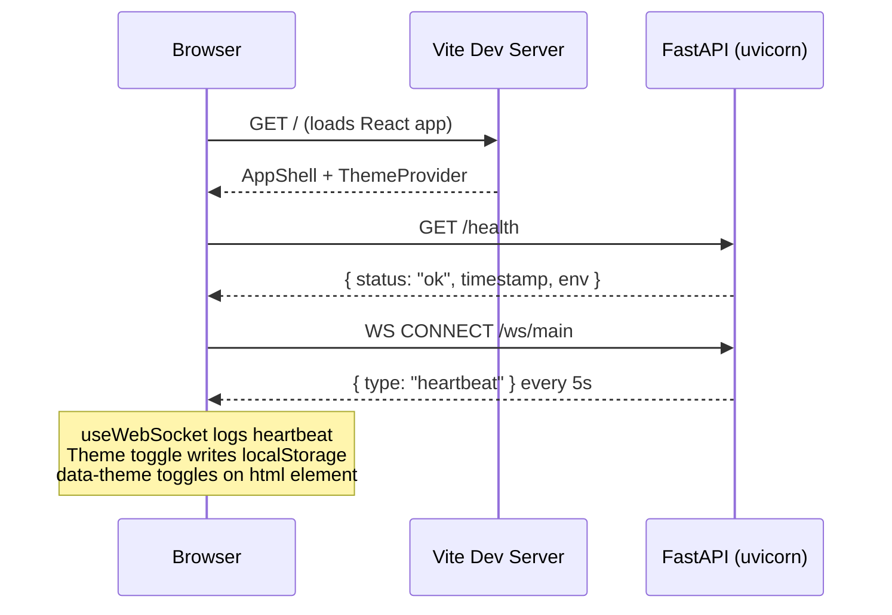

# feat: Bootstrap Phase 0 — Backend and Frontend Foundation

## Overview

Stand up the full project skeleton: FastAPI backend with a `/health` endpoint and WebSocket heartbeat, React + Vite frontend with a dark/light theme system and responsive AppShell, and a connectivity hook that logs the heartbeat in the browser console. No map, no agents, no simulation — just a running, connected, themed foundation that passes Phase 0's exit conditions.

## Problem Frame

CascadeOS has no code. The repo holds only the CLAUDE.md blueprint, pre-created `.env` files with real keys, and pre-downloaded YOLOv8 weights. Every subsequent phase depends on this skeleton being correct. Scaffolding must happen in a specific order to preserve the existing `.env` files and use the correct Python version. (See origin: `docs/brainstorms/phase-0-bootstrap-requirements.md`)

## Requirements Trace

- R1. FastAPI app at `backend/main.py`, CORS from `CORS_ORIGINS` env var
- R2. `backend/config.py` with pydantic-settings; ML vars gated by feature flags; crash on missing required var with named error
- R3. `GET /health` returns `{ status: "ok", timestamp, env: <APP_ENV default "development"> }` with HTTP 200
- R4. WebSocket at `ws://localhost:8000/ws/main`, `{ type: "heartbeat", timestamp }` every 5 seconds
- R5. `backend/requirements.txt` (web/agent/data stack, no version pins); `backend/requirements-ml.txt` (ML stack, not installed); `backend/requirements.lock` generated by `pip freeze`
- R6. Vite scaffold preserves `frontend/.env` AND `frontend/.env.example` intact
- R7. `frontend/src/theme/ThemeProvider.jsx` — reads/writes `data-theme` on `<html>`, persists to `localStorage`
- R8. `frontend/src/theme/theme.css` — all CSS custom properties for both themes per CLAUDE.md spec
- R9. `frontend/src/components/ui/ThemeToggle.jsx` — sun/moon icon, switches theme on click
- R10. `frontend/src/components/layout/AppShell.jsx` — TopBar + collapsible Sidebar + main area + empty bottom-sheet div; hamburger on mobile
- R11. `frontend/src/hooks/useWebSocket.js` — connects to `VITE_WS_URL`, logs heartbeats, exponential backoff reconnect
- R12. `frontend/src/services/api.js` — reads `VITE_API_URL`, no hardcoded localhost
- R13. Google Fonts (DM Sans, IBM Plex Mono) via `<link>` in `frontend/index.html`
- R14. React Strict Mode disabled in `frontend/src/main.jsx`
- R15. `backend/requirements.lock` generated; subsequent installs use the lock file

## Scope Boundaries

- No infrastructure graph, map, agents, simulation, cascade engine — Phase 1+.
- Bottom-sheet div is present but empty; no animation.
- Sidebar collapse is functional (CSS-based) but no spring animation.
- No git commit as part of the exit condition (committed separately after verification).

### Deferred to Separate Tasks

- ML stack installation (`torch`, `torch-geometric`, `ultralytics`, `opencv`): Phase 5 installs `backend/requirements-ml.txt`.
- `docs/architecture.md`: Can be created post-Phase 0.

## Context & Research

### Relevant Code and Patterns

- `CLAUDE.md` — authoritative source: CSS variable taxonomy, WebSocket event types, component file structure, responsive breakpoints, font rules, environment variable spec
- `backend/.env` and `frontend/.env` — real keys, must not be touched (640 bytes and 181 bytes, pre-verified)
- `backend/.env.example` and `frontend/.env.example` — template files, both must survive Vite scaffold
- `backend/cv/models/yolov8n.pt` — 6.5 MB, must not be re-downloaded

### Institutional Learnings

- No `docs/solutions/` exists yet (greenfield project).

### External References

- CLAUDE.md is more detailed than external FastAPI or React docs for this specific project — it is the primary implementation reference.

## Key Technical Decisions

- **Use `python3.12` explicitly for venv**: `python3` resolves to 3.14.2 on this machine; PyTorch 2.4.0 wheels do not exist for 3.14. `python3.12` (conda) is available and compatible. Command: `python -m venv backend/.venv` (since `python` resolves to 3.12.2 via conda).
- **Move both `frontend/.env` and `frontend/.env.example` before scaffold**: Vite may fail or overwrite files in a non-empty directory. Both files in `frontend/` must be moved to `/tmp/` before `npm create vite@latest`, then restored.
- **ML vars gated by feature flags**: `MODEL_CHECKPOINT_PATH` and `YOLO_MODEL_PATH` are only validated when `ENABLE_CV=true` / `ENABLE_TGNN=true` respectively. This prevents startup crash in Phases 0–4.
- **`requirements.lock` for reproducibility**: `requirements.txt` has no version pins (latest stable). After install, `pip freeze > requirements.lock`. All subsequent installs use `pip install -r requirements.lock`.
- **Append to `.gitignore`, do not overwrite**: Current `.gitignore` has 5 entries. Append `node_modules/`, `__pycache__/`, `.venv/`, `requirements.lock` before committing the scaffold.
- **`CASCADE_PLAYBACK_SPEED` in config**: This env var appears in `backend/.env.example` but was omitted from CLAUDE.md's env table. It must be included in `config.py` to prevent startup crash.
- **React Strict Mode disabled immediately**: deck.gl double-renders in Strict Mode. Disabling now avoids a confusing Phase 1 debugging session.

## Open Questions

### Resolved During Planning

- **Which Python?**: Use `python` (conda 3.12.2), not `python3` (Homebrew 3.14.2).
- **Does Vite refuse non-empty directories?**: Yes — move both `.env` and `.env.example` to `/tmp/` before scaffold, restore after.
- **Where does `CASCADE_PLAYBACK_SPEED` go?**: In `config.py` as an optional float with default `1.0`.
- **How should `APP_ENV` work?**: Add `APP_ENV` to `config.py` as optional string defaulting to `"development"`. Include in `/health` response as `env` field.

### Deferred to Implementation

- **Exact pydantic-settings field names**: Discovered when writing `config.py` and running the app.
- **Whether `npm create vite@latest frontend` prompts interactively**: If it does, the implementer should use `echo "y" |` or the `--force` flag if available. Verify at execution time.
- **Which packages have breaking API changes since 2024**: Check `pip install` output for deprecation warnings; resolve individually during implementation.

## Output Structure

```
backend/
├── .env                         # EXISTS — DO NOT TOUCH
├── .env.example                 # EXISTS — DO NOT TOUCH
├── main.py                      # CREATE
├── config.py                    # CREATE
├── requirements.txt             # CREATE
├── requirements-ml.txt          # CREATE
├── requirements.lock            # GENERATED after install
├── routers/
│   ├── __init__.py              # CREATE (empty)
│   └── ws.py                    # CREATE
├── cv/
│   └── models/                  # EXISTS — DO NOT TOUCH
└── .venv/                       # GENERATED by venv

frontend/
├── .env                         # EXISTS — restore after scaffold
├── .env.example                 # EXISTS — restore after scaffold
├── index.html                   # MODIFY (add Google Fonts link)
├── vite.config.js               # GENERATED
├── package.json                 # GENERATED
└── src/
    ├── main.jsx                 # MODIFY (disable Strict Mode)
    ├── App.jsx                  # MODIFY (wire ThemeProvider)
    ├── theme/
    │   ├── ThemeProvider.jsx    # CREATE
    │   ├── theme.css            # CREATE
    │   └── useTheme.js          # CREATE
    ├── components/
    │   ├── layout/
    │   │   ├── AppShell.jsx     # CREATE
    │   │   ├── TopBar.jsx       # CREATE
    │   │   └── Sidebar.jsx      # CREATE
    │   └── ui/
    │       └── ThemeToggle.jsx  # CREATE
    ├── hooks/
    │   └── useWebSocket.js      # CREATE
    ├── services/
    │   └── api.js               # CREATE
    └── styles/
        ├── global.css           # CREATE
        └── responsive.css       # CREATE

.gitignore                       # MODIFY (append new entries)
```

## High-Level Technical Design

> *This illustrates the intended approach and is directional guidance for review, not implementation specification. The implementing agent should treat it as context, not code to reproduce.*



## Implementation Units

- [ ] **Unit 1: Backend Python environment and dependency files**

**Goal:** Create the Python venv with the correct interpreter, write `requirements.txt` (web/agent stack), write `requirements-ml.txt` (ML stack, deferred), install, freeze to `requirements.lock`.

**Requirements:** R5, R15

**Dependencies:** None

**Files:**
- Create: `backend/requirements.txt`
- Create: `backend/requirements-ml.txt`
- Create: `backend/.venv/` (generated by venv command)
- Create: `backend/requirements.lock` (generated by pip freeze)

**Approach:**
- Use `python -m venv backend/.venv` (conda 3.12.2, not `python3` which is 3.14.2)
- `requirements.txt` contains web/agent/data deps with no version pins: fastapi, uvicorn[standard], websockets, python-multipart, python-dotenv, pydantic-settings, pydantic, anthropic, langchain, langchain-anthropic, langgraph, networkx, numpy, scikit-learn, httpx, aiohttp, python-dateutil, pytz
- `requirements-ml.txt` contains the deferred ML stack: torch, torch-geometric, numpy (already in base), scikit-learn (already in base), ultralytics, opencv-python-headless, Pillow — note this file exists but is NOT installed in Phase 0
- After install: `pip freeze > backend/requirements.lock`
- Verify install succeeded by importing `fastapi`, `pydantic_settings`, `langgraph` in the activated venv

**Patterns to follow:** `backend/.env.example` — reference for which packages are needed (not their versions)

**Test scenarios:**
- Happy path: `pip install -r backend/requirements.txt` completes without errors; `python -c "import fastapi, pydantic_settings, langgraph, networkx"` exits 0
- Error path: Running with `python3` (3.14.2) instead of `python` and attempting to install should be documented as a known failure mode — not executed, but noted

**Verification:**
- `backend/.venv/bin/python -c "import fastapi"` exits 0
- `backend/requirements.lock` exists and has more than 10 lines
- `backend/requirements-ml.txt` exists but its packages are NOT present in the venv (`import torch` should fail)

---

- [ ] **Unit 2: Backend config.py with pydantic-settings**

**Goal:** Implement env var loading that crashes immediately on missing required vars, gates ML vars on feature flags, and includes `CASCADE_PLAYBACK_SPEED` and `APP_ENV`.

**Requirements:** R2, R3 (env field)

**Dependencies:** Unit 1 (venv + pydantic-settings installed)

**Files:**
- Create: `backend/config.py`

**Approach:**
- All env vars loaded via a single pydantic-settings `Settings` class
- Required always: `ANTHROPIC_API_KEY`, `NYC_OPEN_DATA_APP_TOKEN`, `NYC_311_ENDPOINT`, `NYC_DOT_CAMERA_API_URL`, `HOST`, `PORT`, `CORS_ORIGINS`
- Optional with defaults: `APP_ENV` (default `"development"`), `CASCADE_PLAYBACK_SPEED` (default `1.0`)
- ML-gated: `MODEL_CHECKPOINT_PATH` only validated when `ENABLE_TGNN=true`; `YOLO_MODEL_PATH` only validated when `ENABLE_CV=true`. Use a `model_validator` or `field_validator` for this
- `ENABLE_CV` and `ENABLE_TGNN` default to `true` to match `.env.example`, but if the ML files do not exist the validation should not crash (defer the file-existence check to the phase that uses them)
- A module-level `settings = Settings()` singleton is instantiated at import time so any startup failure surfaces before the app binds to a port
- `CORS_ORIGINS` is a comma-separated string — split into a list for FastAPI middleware

**Patterns to follow:** pydantic-settings `BaseSettings` with `model_config = SettingsConfigDict(env_file=".env")` pattern

**Test scenarios:**
- Happy path: With all required vars present in `.env`, `from config import settings` succeeds and `settings.ANTHROPIC_API_KEY` is non-empty
- Error path: If `ANTHROPIC_API_KEY` is removed/empty, startup raises a `ValidationError` naming the missing field — not a silent `None`
- Edge case: `ENABLE_CV=false` — `YOLO_MODEL_PATH` is not validated even if absent
- Edge case: `CORS_ORIGINS` with two comma-separated URLs splits correctly into a list of length 2

**Verification:**
- `python -c "from config import settings; print(settings.APP_ENV)"` from `backend/` with venv active prints `"development"`
- Temporarily removing `ANTHROPIC_API_KEY` from `.env` and running the same command crashes with a readable error (restore key after test)

---

- [ ] **Unit 3: FastAPI app, /health endpoint, and WebSocket heartbeat**

**Goal:** Boot a working FastAPI server with CORS, a health check endpoint, and a WebSocket endpoint that pushes a heartbeat message every 5 seconds.

**Requirements:** R1, R3, R4

**Dependencies:** Unit 2 (config.py)

**Files:**
- Create: `backend/main.py`
- Create: `backend/routers/__init__.py`
- Create: `backend/routers/ws.py`

**Approach:**
- `main.py` instantiates the FastAPI app, adds `CORSMiddleware` with origins from `settings.CORS_ORIGINS`, and includes the WS router
- `/health` is defined directly in `main.py` (not a router) — it returns the dict with `status`, `timestamp` (ISO format), and `env` from `settings.APP_ENV`
- `routers/ws.py` defines the `/ws/main` WebSocket endpoint. On connection: enter a loop, `await asyncio.sleep(5)`, then `await websocket.send_json({"type": "heartbeat", "timestamp": datetime.utcnow().isoformat()})`. Handle `WebSocketDisconnect` to exit the loop cleanly
- CORS must allow all origins listed in `settings.CORS_ORIGINS` and explicitly allow all methods and headers — the frontend dev server runs on a different port

**Patterns to follow:** FastAPI `APIRouter`, native `WebSocket` endpoint from `fastapi`, `asyncio.sleep` for the heartbeat loop

**Test scenarios:**
- Happy path: `GET /health` returns `{"status": "ok", "timestamp": "<ISO string>", "env": "development"}` with HTTP 200
- Happy path: WebSocket client connects to `/ws/main`, receives a JSON message with `type == "heartbeat"` within 6 seconds, receives another within 11 seconds
- Error path: WebSocket client disconnects mid-heartbeat loop — server does not crash; logs `WebSocketDisconnect` and exits the loop
- Integration: CORS header `Access-Control-Allow-Origin: http://localhost:5173` is present on the `/health` response when the request includes `Origin: http://localhost:5173`

**Verification:**
- `uvicorn main:app --reload` starts without errors from `backend/` with venv active
- `curl http://localhost:8000/health` returns 200 with the expected JSON shape

---

- [ ] **Unit 4: Frontend Vite scaffold and package installs**

**Goal:** Scaffold the React + Vite project into `frontend/`, preserving both `.env` files, install all required npm packages, disable React Strict Mode, append new entries to the root `.gitignore`.

**Requirements:** R6, R14

**Dependencies:** None (independent of backend units)

**Files:**
- Modify: `frontend/.env` (move to `/tmp/` and restore — content unchanged)
- Modify: `frontend/.env.example` (move to `/tmp/` and restore — content unchanged)
- Create: `frontend/package.json`, `frontend/vite.config.js`, `frontend/src/main.jsx`, `frontend/src/App.jsx`, `frontend/index.html` (all generated by Vite scaffold)
- Modify: `frontend/src/main.jsx` (disable Strict Mode)
- Modify: `.gitignore` (append entries)

**Approach:**
- Move both `frontend/.env` and `frontend/.env.example` to `/tmp/` before running the Vite scaffold
- Run: `npm create vite@latest frontend -- --template react` from the repo root. If the command prompts interactively about the non-empty directory, use the "ignore files and continue" option or the `--force` flag
- After scaffold completes, restore both files from `/tmp/` back to `frontend/`
- `cd frontend && npm install`
- Install additional packages: `@deck.gl/core @deck.gl/layers @deck.gl/react @deck.gl/mapbox reactflow mapbox-gl lucide-react clsx`
- Disable Strict Mode in `frontend/src/main.jsx`: remove the `<React.StrictMode>` wrapper around `<App />`
- Append to root `.gitignore`: `node_modules/`, `__pycache__/`, `backend/.venv/`, `requirements.lock` (literal — do NOT use `*.lock` glob, which would also match `frontend/package-lock.json` and break npm reproducibility)

**Patterns to follow:** Vite React template default structure; lucide-react for icon components

**Test scenarios:**
- Test expectation: none — this is a scaffolding unit with no behavioral logic of its own. Verification is the only check needed.

**Verification:**
- `cat frontend/.env` shows all three env vars with real values (not empty, not overwritten)
- `cat frontend/.env.example` is intact
- `npm run dev` from `frontend/` starts the dev server on port 5173 without errors
- `import('@deck.gl/core')` does not throw (verified by checking `frontend/node_modules/@deck.gl/` exists)
- `frontend/src/main.jsx` does NOT contain `React.StrictMode`

---

- [ ] **Unit 5: Theme system — CSS custom properties, ThemeProvider, useTheme, ThemeToggle**

**Goal:** Implement the full dark/light theme system: all CSS variables for both themes, a React context provider that reads/writes `data-theme` on `<html>` and persists to `localStorage`, and a toggle component with a sun/moon icon.

**Requirements:** R7, R8, R9

**Dependencies:** Unit 4 (scaffold + lucide-react installed)

**Files:**
- Create: `frontend/src/theme/theme.css`
- Create: `frontend/src/theme/ThemeProvider.jsx`
- Create: `frontend/src/theme/useTheme.js`
- Create: `frontend/src/components/ui/ThemeToggle.jsx`
- Modify: `frontend/index.html` (import theme.css globally, or import in main.jsx)
- Modify: `frontend/src/App.jsx` (wrap with ThemeProvider)

**Approach:**
- `theme.css` defines two selector blocks: `:root[data-theme="dark"]` and `:root[data-theme="light"]`, each containing the full set of CSS custom properties from CLAUDE.md (bg-primary through glow-red). No colors may appear as raw hex values outside these blocks.
- `ThemeProvider.jsx` creates a React context. On mount, reads `localStorage` for `"cascadeos-theme"`. If not set, defaults to `"dark"`. Sets `document.documentElement.setAttribute("data-theme", theme)`. Provides a `toggleTheme` function to consumers.
- `useTheme.js` exposes the context value — a simple hook wrapper.
- `ThemeToggle.jsx` consumes `useTheme`, renders `Sun` icon (from lucide-react) in dark mode and `Moon` icon in light mode, calls `toggleTheme` on click.
- Import `theme.css` in `frontend/src/main.jsx` or `frontend/index.html` (whichever the Vite scaffold makes easiest for global import).

**Patterns to follow:** React Context API, `document.documentElement.setAttribute`, lucide-react icon usage

**Test scenarios:**
- Happy path: App loads in dark mode by default when localStorage has no stored preference. `html` element has `data-theme="dark"`.
- Happy path: Clicking ThemeToggle switches `data-theme` from `"dark"` to `"light"`, the icon changes from Sun to Moon (or vice versa).
- Edge case: Refreshing the page after switching to light mode — `data-theme="light"` is restored from `localStorage` without flash.
- Edge case: `localStorage.getItem("cascadeos-theme")` returns an unrecognized value — falls back to `"dark"`.
- Integration: A CSS variable (`--bg-primary`) resolves to the correct hex value for each theme. Verifiable via browser DevTools computed styles.

**Verification:**
- Browser shows dark background on first load
- Clicking toggle visibly changes all themed colors simultaneously
- Refreshing the page after a theme switch retains the selected theme

---

- [ ] **Unit 6: AppShell layout — TopBar, Sidebar, responsive grid**

**Goal:** Build the application chrome: a TopBar containing the ThemeToggle, a collapsible Sidebar (hamburger on mobile), a main content area, and an empty bottom-sheet div. Mobile-first CSS.

**Requirements:** R10

**Dependencies:** Unit 5 (ThemeProvider and ThemeToggle must exist)

**Files:**
- Create: `frontend/src/components/layout/AppShell.jsx`
- Create: `frontend/src/components/layout/TopBar.jsx`
- Create: `frontend/src/components/layout/Sidebar.jsx`
- Create: `frontend/src/styles/global.css`
- Create: `frontend/src/styles/responsive.css`
- Modify: `frontend/src/App.jsx` (render AppShell)

**Approach:**
- `AppShell.jsx` is the layout root. It renders: `<TopBar />`, a flex/grid container with `<Sidebar />` and a main content `<div>`, and a bottom-sheet `<div className="bottom-sheet">` with no content. `AppShell` owns sidebar-open state; passes toggle handler to TopBar (for hamburger) and to Sidebar.
- `TopBar.jsx` renders: app title/logo on the left, `<ThemeToggle />` on the right. On mobile, also renders a hamburger button that toggles the sidebar.
- `Sidebar.jsx` renders a nav area. On desktop (≥768px), it is always visible. On mobile (<768px), it is hidden by default and slides in when sidebar-open state is true. CSS-only transition, no JS animation library.
- `global.css` imports `theme.css` (or re-exports it), sets base styles: `box-sizing: border-box`, font families (`DM Sans` for UI, `IBM Plex Mono` for data), `margin: 0`, `background: var(--bg-primary)`, `color: var(--text-primary)`.
- `responsive.css` defines the three breakpoints from CLAUDE.md: base (375px mobile), `@media (min-width: 768px)`, `@media (min-width: 1280px)`, `@media (min-width: 1920px)`.
- All color values use CSS custom properties (`var(--bg-primary)`, etc.) — no hardcoded hex values anywhere in layout components.

**Patterns to follow:** CSS custom properties from `theme.css`, mobile-first `@media (min-width)` breakpoints

**Test scenarios:**
- Happy path: At desktop viewport (1280px), TopBar and Sidebar are both visible side by side; main content area fills remaining space.
- Happy path: ThemeToggle in TopBar switches the theme; all CSS variables update simultaneously.
- Edge case (mobile): At 375px viewport, Sidebar is hidden. Hamburger button is visible in TopBar. Clicking it shows the Sidebar.
- Edge case (mobile): Bottom-sheet div is present in the DOM (verifiable via DevTools) but has no visible content and does not affect layout.
- Integration: Sidebar collapse at mobile → desktop transition does not leave a stuck open/closed state.

**Verification:**
- Browser at 375px shows hamburger, no sidebar
- Browser at 1280px shows sidebar always open
- No hardcoded color hex values in any layout component file

---

- [ ] **Unit 7: Frontend connectivity — useWebSocket hook and api.js service**

**Goal:** Implement the WebSocket hook (connects to backend, logs heartbeats, exponential backoff reconnect) and the API service helper (reads base URL from env). Verify the heartbeat appears in the browser console against a running backend.

**Requirements:** R11, R12

**Dependencies:** Unit 4 (scaffold), Unit 3 (running backend with WebSocket endpoint)

**Files:**
- Create: `frontend/src/hooks/useWebSocket.js`
- Create: `frontend/src/services/api.js`
- Modify: `frontend/src/App.jsx` (call `useWebSocket` to initiate connection on mount)

**Approach:**
- `useWebSocket.js` is a custom hook. On mount, constructs a `WebSocket` by appending `/main` to `import.meta.env.VITE_WS_URL` (e.g., `ws://localhost:8000/ws/main`). This is necessary because `VITE_WS_URL` in `frontend/.env` is `ws://localhost:8000/ws` (the base path), but the server endpoint is at `/ws/main`. On `onmessage`, parses JSON and logs to console: `[heartbeat] <timestamp>`. If `VITE_WS_URL` is undefined, the hook logs a warning and returns without throwing (guard: `if (!url) { console.warn('[useWebSocket] VITE_WS_URL is not set'); return; }`). On `onclose` or `onerror`, schedules reconnect using exponential backoff: initial delay 1s, doubles on each failure, caps at 30s. Reconnect must be cancelable on component unmount (clear the timeout in the cleanup function). Exposes `{ lastMessage, readyState }` to consumers.
- `api.js` exports a single `apiFetch(path, options)` helper that prepends `import.meta.env.VITE_API_URL` to `path` and calls `fetch`. No axios, no hardcoded URLs.
- `App.jsx` calls `useWebSocket()` at the top level so the connection is established when the app mounts.

**Technical design:**
*(Directional guidance — not implementation specification.)*
```
useWebSocket mount:
  url = VITE_WS_URL + '/main'   // e.g. ws://localhost:8000/ws + /main
  if (!url) { console.warn(...); return }
  ws = new WebSocket(url)
  ws.onmessage = (e) => console.log('[heartbeat]', JSON.parse(e.data))
  ws.onclose/onerror = () => {
    delay = min(delay * 2, 30000)
    timeout = setTimeout(() => reconnect(), delay)
  }
unmount: clearTimeout(timeout), ws.close()
```

**Patterns to follow:** React `useEffect` with cleanup, `WebSocket` browser API, `import.meta.env` for Vite env vars

**Test scenarios:**
- Happy path: With backend running, browser console shows `[heartbeat]` log within 6 seconds of page load, then again every 5 seconds.
- Happy path: `apiFetch('/health')` resolves to the `/health` JSON response without any hardcoded URL in the source.
- Error path: With backend stopped, `useWebSocket` retries with increasing delays. No uncaught exceptions in the console; retry attempts are logged.
- Edge case: If `VITE_WS_URL` is undefined (missing from `.env`), the hook should log a clear warning instead of throwing.
- Integration: Navigating away and back (component unmount/remount) does not leave orphaned WebSocket connections — the old connection closes cleanly before the new one opens.

**Verification:**
- Backend running at port 8000, frontend dev server at 5173: browser console shows heartbeat every 5 seconds
- Killing the backend and waiting — console shows retry attempts (not silent failure)
- `grep -r "localhost" frontend/src/` returns no matches (no hardcoded URLs)

---

## System-Wide Impact

- **Interaction graph:** `App.jsx` mounts `ThemeProvider` (wrapping all children) and calls `useWebSocket` (initiating the WS connection). `AppShell` nests `TopBar` which calls `useTheme`. All theme consumers are downstream of `ThemeProvider`.
- **Error propagation:** Backend startup errors surface via uvicorn process exit (not HTTP 500). Frontend WS errors surface via `onerror` handler in `useWebSocket` — should not crash the app.
- **State lifecycle risks:** Theme state lives in `localStorage` + React context. If `localStorage` is unavailable (private browsing restrictions), the hook should catch the error and fall back to in-memory state. WS reconnect timer must be cleared on unmount to prevent memory leaks.
- **API surface parity:** `/health` is the only REST endpoint in Phase 0. Its response shape (`status`, `timestamp`, `env`) must remain stable — later phases add more endpoints but do not modify this one.
- **Integration coverage:** The single critical cross-layer scenario is: frontend `useWebSocket` connects → backend `/ws/main` accepts → backend sends heartbeat → frontend console logs it. This must be manually verified in the browser (no automated test framework is set up in Phase 0).
- **Unchanged invariants:** `backend/.env`, `frontend/.env`, `backend/cv/models/yolov8n.pt`, and the root `.gitignore` (5 existing entries) must all be in exactly their pre-Phase-0 state after every unit — their content must not change, only new files are added alongside them.

## Risks & Dependencies

| Risk | Mitigation |
|------|------------|
| `npm create vite@latest frontend` prompts interactively for non-empty directory | Pre-move both `.env` and `.env.example` to `/tmp/`; if prompt still appears, select "ignore files and continue" (option 3 in recent Vite versions) |
| `python3` resolves to 3.14.2 and pip fails on C extension wheels | Use `python` (conda 3.12.2) explicitly; verify `python --version` shows 3.12.x before creating venv |
| Latest langgraph / langchain-anthropic have breaking API changes | After `pip install`, import each critical package and check version in the lock file; note version in implementation notes if a breaking change is found |
| `frontend/.env` or `frontend/.env.example` not restored after scaffold | Verify file sizes and content immediately after scaffold before proceeding to npm install |
| WebSocket heartbeat loop blocks if `await asyncio.sleep` is not inside the disconnect handler | Ensure `WebSocketDisconnect` is caught outside the `asyncio.sleep` call, not silently swallowed |
| `.venv/` accidentally staged in git | Verify `.gitignore` has `backend/.venv/` appended before running any `git add` |

## Documentation / Operational Notes

- After Phase 0 exits, run `git add` carefully — exclude `.venv/`, `node_modules/`, and `requirements.lock` from the staged set (they should be gitignored by then).
- The commit message format matches repo convention: `bootstrap: venv, requirements.txt, frontend scaffold`.
- `requirements.lock` is gitignored. Teammates onboarding with `pip install -r requirements.txt` get latest stable; teammates reproducing exact deps use `pip install -r requirements.lock`.

## Sources & References

- **Origin document:** [docs/brainstorms/phase-0-bootstrap-requirements.md](docs/brainstorms/phase-0-bootstrap-requirements.md)
- CLAUDE.md — primary implementation reference (CSS variable taxonomy, WS event types, responsive breakpoints)
- `backend/.env.example` — canonical env var list including `CASCADE_PLAYBACK_SPEED`
- Related: GitHub repo at `https://github.com/raunak-choudhary/cascadeos`
